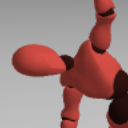

# Marionettes

A tool to edit and preview 3d-model postures.

Try [the demo](https://roipoussiere.frama.io/marionettes)!

## Features

- loads model from a from `.glb` or `.fbx` skeleton files (any model from [Mixamo](https://www.mixamo.com/#/?type=Character) should be fine);
- high precision model (spine, fingers, etc.);
- built-in serializer (can be used to save postures in file or share them via url, see demo);
- optional fullscreen mode

## Installation

### Via yarn / npm

This project is [published on npm registry](https://www.npmjs.com/package/marionettes).

    yarn install marionettes

### Via sources

    git clone https://framagit.org/roipoussiere/marionettes.git
    cd marionettes
    yarn install

## Usage

Check out the [index page source](src/index.ts), which is used to build the demo page.

## Alternatives

- [Boytchev's mannequin.js](https://boytchev.github.io/mannequin.js/)

### Credits

- Marionettes source code: Nathanaël Jourdane and contributors, [MIT liense](./LICENSE);
- 3D model used in the demo page: [Mixamo](https://www.mixamo.com/#/?type=Character), royalty free;
- Postures created with Marionettes: it's up to you, of course. :)
